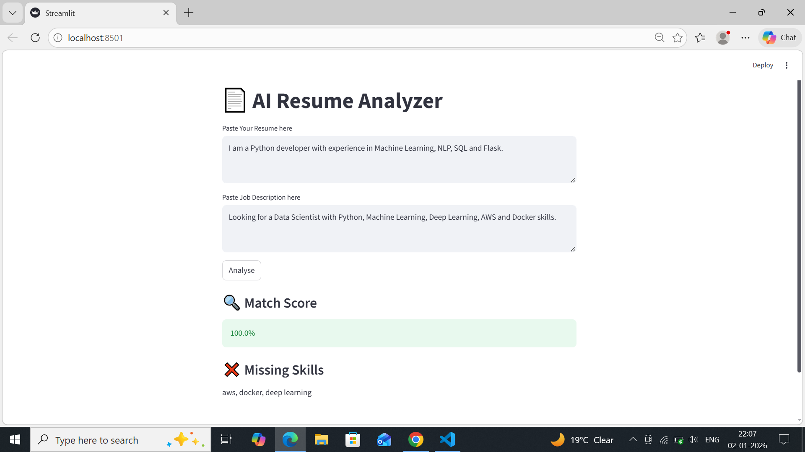

# 🤖 AI Resume Analyzer

An AI-powered Resume Analyzer that compares a resume with a job description
and provides:
- Resume–JD match score
- Missing skills
- Simple improvement insights

## 🚀 Features
- Semantic similarity using Sentence Transformers
- Skill gap analysis
- Beginner-friendly & free (CPU only)
- Built with Hugging Face models

## 📸 Screenshot


## 🛠 Tech Stack
- Python
- Hugging Face (Sentence Transformers)
- Scikit-learn
- Streamlit

## 📦 Installation
```bash
git clone https://github.com/YOUR_USERNAME/ai-resume-analyzer.git
cd ai-resume-analyzer
pip install -r requirements.txt
